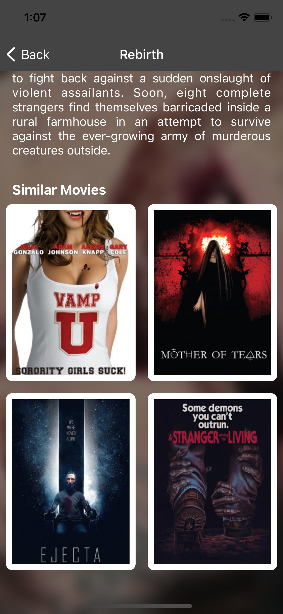

# SwiftyMovies
Assignment for ILI.DIGITAL

## Introduction
This repository contains the project assignment. Below are some comments to be shared from the developer.

## Usage and Tools
The current supported iOS verions are v14.5 and above. Xcode version used for this project is v12.5. Download the repo and install pods if necessary.

## Core Functionality
This is a movies app where user can see list of available movies, can search throught the list, can see movie details and can download the movie.

## Explanation

### Home Screen List View
This is the screen where user landed for the first time. Here user can see a list of available movies. Can Search through them and see a little bit of the details as well.

### Home Screen Grid View
The user can also see the movies in grid view. Just click on the top right button and the display will change.

### Home Screen Search
As the user starts typing the title of the movie, the display of the app starts updating immediately depending upon the words used by the user.

### Movie Detail Screen
Next is the movie details screen where user can see movie description in more detail.

### Movie Detail Screen - Suggessions
Also the user can also the more movie suggession at the last part of the movie detail screen.

User can also download the movie by clicking on the download button in the movie detail screen. And in the end, the user can also view suggessted movie detail by clicking on any of the item available.

## Auther
Hamza Farooq, hamza_faroooq@yahoo.com
